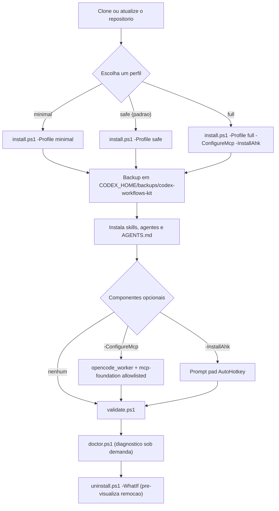
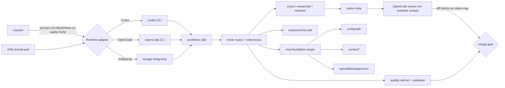

# Codex Workflows Kit

Kit local, Windows-first, que instala em Codex CLI, Google Antigravity e
OpenCode um roteador canonico de workflows (`$workflows`), a skill condicional
`evidence-first`, sub-agents com escopo fixo (`scout`, `researcher`,
`reviewer`, `worker`), uma fundacao MCP allowlisted (`mcp-foundation`) e um
prompt pad AutoHotkey opcional — tudo a partir de uma worktree versionada,
com instalacao parametrizada por perfil (`safe` / `full` / `minimal`), backup
antes de sobrescrever, dry-run (`-WhatIf`), diagnostico (`doctor.ps1`) e
remocao (`uninstall.ps1`).

> **Seguranca primeiro.** Nunca instale este kit com um pipeline remoto
> (`irm ... | iex`). Baixe ou clone o repositorio, revise os scripts em
> `scripts/` e rode os comandos abaixo do seu proprio checkout. Os perfis
> `minimal`/`safe` são locais; `-ConfigureMcp` pode chamar CLIs e provedores
> necessários ao reparo explicitamente solicitado. O kit não registra
> telemetria. Detalhes em
> `docs/security.md` e em `SECURITY.md`.

Documentacao: [Arquitetura](docs/architecture.md) · [Seguranca](docs/security.md)
· [Prompt de bootstrap do agente](docs/agent-bootstrap-prompt.md) ·
[Contribuicao](CONTRIBUTING.md) · [Changelog](CHANGELOG.md).

## O que o kit instala

| Componente | Runtime | Finalidade |
|---|---|---|
| skill `workflows` + aliases `codex-workflows`, `antigravity-workflows`, `opencode-workflows` | Codex, Antigravity, OpenCode | roteador canonico de modos (`PLAN.AUTO`, `DELIVER.AUTO`, `COMMIT`, ...) |
| skill `evidence-first` | Codex, Antigravity, OpenCode | verificacao de claims materiais, sem atalho dedicado |
| agents nativos `relay`, `scout`, `researcher`, `reviewer`, `worker` (com variantes de esforco) | Codex | sub-agents com sandbox read-only ou write escopado |
| agents OpenCode `scout`, `researcher`, `reviewer`, `worker` | OpenCode | readers sem edicao e writer com claim-map + worktree isolada |
| `codex/AGENTS.md` | Codex | instrucoes globais compactas |
| plugin `mcp-foundation` | Codex | MCPs allowlisted: CodeGraph, Context7, OpenAI Developer Docs |
| `ahk/codex_prompt_pad.ahk` | AutoHotkey v2 | atalhos NUM que colam modos `$workflows` |
| `scripts/install.ps1`, `scripts/validate.ps1` | PowerShell | instalacao e validacao |

## Requisitos

- Windows 10 ou 11 (suporte Windows-first).
- PowerShell 5.1+ (Windows PowerShell) ou PowerShell 7+.
- Pelo menos um runtime suportado: Codex CLI, Google Antigravity ou OpenCode.
- Opcionais: AutoHotkey v2 (prompt pad) e OpenCode CLI (writer e bridge MCP).

Os scripts sao locais. Se a politica de execucao exigir, permita apenas o
escopo do usuario (`Set-ExecutionPolicy -Scope CurrentUser RemoteSigned`)
depois de revisar o conteudo — nunca use bypass nem pipelines remotos.

## Layout

```text
skills/workflows/         Workflow skill canonica para Codex, Antigravity e OpenCode
skills/evidence-first/    Grounding e verificacao condicional, sem atalho
agents/                   Relay nativo, perfis de override e roles OpenCode
codex/AGENTS.md           Instrucoes globais compactas
plugins/mcp-foundation/   MCPs allowlisted, hook de auditoria e manutencao
ahk/codex_prompt_pad.ahk  Prompt pad AutoHotkey
scripts/install.ps1       Instala os arquivos nos destinos reais
scripts/validate.ps1      Valida estrutura e AHK
docs/                     Documentacao publica (arquitetura, seguranca, bootstrap)
```

## Instalacao

A instalacao e parametrizada por perfil e por flags. A interface abaixo e o
contrato público do instalador: os comandos `doctor` e `uninstall` e as
flags de perfil são versionados junto com o código — mudanças são refletidas
neste README e no `CHANGELOG.md`.

### Perfis

| Perfil | Escopo instalado |
|---|---|
| `minimal` | somente as skills `workflows` e `evidence-first` para o runtime atual |
| `safe` (padrao) | skills, agentes, `AGENTS.md` e aliases de compatibilidade; sem MCP, OpenCode ou AHK |
| `full` | tudo do `safe` + agents OpenCode, wrapper, mantenedor e skills nos destinos Antigravity; o MCP e o AHK continuam opt-in por flag |

### Comandos

```powershell
.\scripts\install.ps1 -Profile safe
.\scripts\install.ps1 -Profile full -ConfigureMcp -InstallAhk
.\scripts\doctor.ps1
.\scripts\uninstall.ps1 -WhatIf
```

### Flags

| Flag | Efeito |
|---|---|
| `-Profile safe\|full\|minimal` | seleciona o escopo da instalacao (padrao: `safe`) |
| `-ConfigureMcp` | gera o bloco `opencode_worker`, instala o mantenedor MCP e executa o reparo allowlisted; a tarefa semanal só é criada com `-InstallScheduledTask` |
| `-InstallAhk` | instala o prompt pad AutoHotkey, com backup do arquivo existente |
| `-InstallAntigravity` | instala as skills também em `-AntigravityHome` (o perfil `full` já ativa esse destino) |
| `-InstallScheduledTask` | cria/reaproveita a tarefa de manutenção; exige `-ConfigureMcp` |
| `-Force` | permite substituir `AGENTS.md` ou `opencode_worker` sem bloco gerenciado, após revisar o backup |
| `-CodexHome`, `-AgentsHome`, `-AntigravityHome`, `-AhkDestination` | substitui os destinos padrão do usuário; para um `-CodexHome` não padrão, mantenha também `CODEX_HOME` definido para o hook SessionStart |
| `-WhatIf` | dry-run: lista o que seria instalado, sobrescrito ou removido, sem tocar no disco |

### O que o instalador faz

- Copia skills, agentes e `AGENTS.md` para os destinos reais do runtime
  (`~/.agents/skills`, `~/.codex/agents`, `~/.codex/opencode-agents` etc.).
- Antes de sobrescrever um destino existente, cria um backup com timestamp em
  `%CODEX_HOME%\backups\codex-workflows-kit\`.
- E idempotente: rodar de novo sobre uma instalacao atual nao duplica nem
  corrompe nada, e nunca remove arquivos do usuario.
- Sem `-ConfigureMcp`, os perfis copiam somente arquivos locais; com essa flag,
  o mantenedor pode chamar `codex`, `npm` e provedores necessários ao reparo
  allowlisted.
- `doctor.ps1` compara os destinos com o estado registrado na última
  instalação e reporta arquivos ausentes ou modificados (somente leitura).
- `uninstall.ps1` remove os arquivos gerenciados pelo kit e os blocos que ele
  adicionou; preserva registros MCP, tarefas, backups e pacotes externos.
  Use `-WhatIf` para pre-visualizar.

### Fluxo de instalacao



## Arquitetura



O `$workflows` seleciona apenas o modo; o contrato completo de cada modo vive
na skill e em `skills/workflows/references/` (mode-matrix, quality ratchet,
observabilidade, sub-agents, validacao). A analise detalhada de componentes,
permissionamento e fluxos esta em `docs/architecture.md`.

## Primeiros passos

1. Instale: `.\scripts\install.ps1 -Profile full -ConfigureMcp -InstallAhk`
   (ou o perfil que fizer sentido para voce). `-ConfigureMcp` requer Codex CLI,
   Node/npm e autenticações externas quando aplicável; sem essas dependências,
   instale primeiro `safe` ou `full` sem a flag.
2. Valide: `.\scripts\validate.ps1`.
3. Em uma sessao nova do Codex, cole:

```text
$workflows mode=PLAN.AUTO
```

O agente carrega a skill `workflows` e segue o contrato do modo. Para
"vincular" um agente novo aos contratos do kit antes da primeira tarefa, use
o prompt copiavel em `docs/agent-bootstrap-prompt.md`.

## Validar

```powershell
.\scripts\validate.ps1
```

## MCP foundation

`mcp-foundation` empacota apenas os MCPs allowlisted:

- CodeGraph para navegacao estrutural;
- Context7 para documentacao atual de bibliotecas;
- OpenAI Developer Docs para Codex e APIs OpenAI.

O instalador registra o marketplace local, instala o plugin e copia o mantenedor
para `~/.codex/maintenance/maintain-mcps.ps1`. A tarefa semanal só é criada
com `-InstallScheduledTask` e não encerra processos MCP ativos. O hook de início faz somente uma
auditoria local com TTL de 24 horas. O Codex exige revisao unica do hook em
`/hooks`, e o Context7 remoto exige autenticacao unica em
**Settings > MCP servers > Authenticate**.

## Roteamento interno dos sub-agents

O backend interno padrão é `internal_subagent_backend=opencode` com transporte
`internal_subagent_transport=native_relay`, definido em
`skills/workflows/references/backend-policy.md`. Você não precisa incluir
uma flag no prompt. Quando o modo precisar de um sidecar, o chat principal abre
um perfil nativo `relay` novo; ele chama o único MCP `opencode_worker`,
preserva a resposta e a repassa como resposta de sub-agent nativo. O relay
continua separado do chat principal e não edita o próprio contexto. Cada prompt
usa uma conversa MCP isolada, sem persistência ou retomada de sessão. O chat
principal continua livre até o gate de decisão/final.

Após integrar a resposta final de um relay, feche o relay concluído para liberar
o slot. Se um novo spawn falhar porque os slots do host estão cheios, aplique
`subA-slot-full`: recupere apenas agentes concluídos/ociosos já integrados ou
aguarde um agente opcional terminar; depois repita o mesmo papel. Nunca feche
agentes ativos, aguardando ou obrigatórios; sem recuperação segura, reporte
bloqueio explícito.

Todos os readers OpenCode configurados podem chamar outros sub-agents e ler
diretórios externos. A escrita continua bloqueada por `edit: deny` e
`bash: deny` nesses perfis. O `worker` OpenCode é o writer padrão: recebe
claim-map, worktree isolada e limites no prompt, usa somente `edit` com
`external_directory: deny`, e mantém `bash`/delegação aninhada bloqueados. O
GPT principal verifica o `cwd` e o baseline antes do spawn, revisa o diff e
executa o guard de caminhos antes de integrar; para edições pequenas ou
críticas, ele ainda pode escrever diretamente. O perfil nativo `worker` fica
apenas como override explícito de manutenção.

Para voltar ao backend nativo, peça explicitamente a um agente para alterar a
política para `internal_subagent_backend=native`. Se o OpenCode estiver
selecionado mas indisponível, o workflow reporta bloqueio; não há fallback
silencioso.

O diretório canônico das definições OpenCode neste projeto é
`agents/opencode`. O instalador mantém uma cópia em
`%CODEX_HOME%\\opencode-agents` e gera a configuração em
`%CODEX_HOME%\\config.toml`:

```toml
[mcp_servers.opencode_worker]
command = "%CODEX_HOME%\\bin\\opencode-worker.cmd"
args = ["-y", "sub-agents-mcp@0.12.0"]
startup_timeout_sec = 30
tool_timeout_sec = 600
enabled = true
enabled_tools = ["run_agent"]

[mcp_servers.opencode_worker.env]
AGENTS_DIR = "%CODEX_HOME%\\opencode-agents"
AGENT_TYPE = "opencode"
AGENT_MODEL = "opencode-go/deepseek-v4-flash"
AGENT_EFFORT = "max"
AGENT_PERMISSION = "yolo"
EXECUTION_TIMEOUT_MS = "600000"
SESSION_ENABLED = "false"
PATH = "<gerado pelo instalador a partir do PATH do Windows>"
```

O trecho TOML usa `%CODEX_HOME%` apenas como marcador documental; o instalador
gera caminhos absolutos para o computador atual. Não cole o marcador literalmente
em um `config.toml`.

O pin `sub-agents-mcp@0.8.0` é incompatível com OpenCode; o suporte oficial
começou em `0.11.0`, e esta integração usa `0.12.0`, que expõe o backend
OpenCode, `AGENT_MODEL` e `AGENT_EFFORT`. O backend encaminha o modelo para
`--model` e o esforço para `--variant`.
Com `SESSION_ENABLED=false`, o MCP não persiste o histórico entre chamadas e
cada relay inicia uma conversa nova.
No Windows, o `PATH` inclui o diretório que contém `opencode.exe`, porque o
backend inicia o CLI com `spawn("opencode")`; sem esse diretório, o shell pode
encontrar `opencode.cmd`, mas o processo filho ainda falha com `ENOENT`.

O ID `opencode-go/deepseek-v4-flash` é a forma provider/model do OpenCode Go;
`AGENT_EFFORT=max` chega ao OpenCode como `--variant max`. Antes do primeiro
uso, confirme o binário, o modelo e a variante diretamente:

```powershell
opencode models
opencode run --model opencode-go/deepseek-v4-flash --variant max "Responda somente OK"
```

O pacote usa `AGENT_PERMISSION=yolo` porque o nível `read-only` hard-coda a
negação de `task` e `external_directory`. Isso não transforma o MCP em sandbox:
readers mantêm `edit: deny`/`bash: deny`, enquanto apenas o writer mantém
`edit: allow`, `bash: deny`, `task: deny` e `external_directory: deny`; o validador rejeita definições fora
desse contrato. `question`, `skill`, `todowrite` e LSP continuam negados. Essas
permissões não são um sandbox de nível de sistema; não envie segredos e use
worktrees isoladas para qualquer writer. A configuração normal pode expor o
MCP `codegraph`, que fica disponível por decisão explícita desta integração;
qualquer outro MCP/custom tool com efeitos colaterais exige revisão separada.
Após alterar
o bloco MCP, reinicie ou reconecte o servidor no Codex.

Referências primárias: [OpenCode CLI](https://dev.opencode.ai/docs/cli/),
[OpenCode Go](https://dev.opencode.ai/docs/de/go/) e
[sub-agents-mcp](https://github.com/shinpr/sub-agents-mcp).

## Quality ratchet

Modos relacionados a código aplicam passivamente a filosofia TN no trecho
tocado: impedem dívida estrutural nova e permitem uma melhoria local quando ela
é relevante, reversível e validável. Contagem de linhas apenas inicia a
inspeção; nunca ordena um split. Refatorações amplas continuam exigindo
`P.DEEP`, `IMPL.PHASE`, `REWORK` ou a auditoria explícita `TN.SKILL`.

## Cadência proporcional

O workflow começa pelo menor caminho capaz de responder à dúvida ou provar o
comportamento pedido. Ele só amplia escopo ou profundidade quando uma evidência
existente ou um risco material revela incerteza, ou quando há um gate obrigatório
ainda aberto; paraleliza trabalho independente já aprovado somente quando isso economiza tempo. Antes de
repetir uma ação sem evidência nova, ele faz um checkpoint e, quando houver uma,
tenta uma única ação diferente e mais barata; se ela falhar ou não existir, e não
houver progresso ou fechamento de gate,
reporta bloqueio ou replaneja. Cada modo tem seu próprio critério de
encerramento; em entregas de código, o caminho do usuário precisa cumprir o
aceite. Melhorias sem relação causal ficam para depois. Não há prazo fixo para
interromper subagents ativos.

## Sincronização do plano no Codex App

A faixa de passos do App acompanha chamadas explícitas a `update_plan`; ela não
deduz progresso apenas porque arquivos mudaram ou testes rodaram. Em tarefas não
triviais com duas ou mais fases, o agente principal cria de 2 a 5 passos curtos e
observáveis: o primeiro começa em andamento e os demais ficam pendentes. Depois
de comprovar uma fase e antes do primeiro comando da próxima, marca a atual como
`completed`, a próxima como `in_progress` e as futuras como pendentes. Se o
escopo mudar, atualiza o plano antes de continuar. Ao provar a última fase,
marca todos os passos como concluídos e deixa nenhum passo em andamento. Não atualiza a lista depois de cada comando, não salta etapas sem prova e reconcilia
o plano antes de concluir. Tarefas simples ou de uma fase não recebem uma lista
artificial.

## Observability

Em tarefas de código, o workflow primeiro decide se realmente precisa de
instrumentação: por padrão, não cria log. Quando ela for necessária, exige uma
pergunta diagnóstica, caminho já existente no projeto, campos seguros, limite
de volume, retenção e acesso aplicados pelo destino, forma de desligar ou
remover e falha segura que não interrompe o fluxo principal, salvo
`contrato audit/compliance` explicitamente aprovado. Não instala coletor, hook,
exportador ou serviço externo sem escopo explícito.

## Atalhos

Ative o ScrollLock para habilitar o prompt pad; com ele desligado, as hotkeys
ficam inativas.

Os atalhos usam o prefixo canônico `$workflows` e selecionam apenas o modo. Os
prefixos `$codex-workflows`, `$antigravity-workflows` e `$opencode-workflows`
continuam disponíveis como aliases de compatibilidade gerados da mesma fonte.
O contrato completo de cada modo vive na skill, em
`references/mode-matrix.md`, no quality ratchet e na referência de
observabilidade quando aplicável; mudanças de comportamento não exigem
alterar o AHK.

```text
NUM1         $workflows mode=PLAN.AUTO
NUM2         $workflows mode=DELIVER.AUTO
NUM3         $workflows mode=COMMIT
NUM4         $workflows mode=BUG.INV
NUM5         $workflows mode=BUG.FIX
NUM6         $workflows mode=DEBUG
NUM7         $workflows mode=REWORK
NUM8         $workflows mode=R.A.F.V
NUM9         $workflows mode=TN.SKILL
NUM*         $workflows mode=RESEARCH.DEEP

NUM0+1       $workflows mode=P.DEEP
NUM0+2       $workflows mode=IMPL.PHASE
NUM0+3       $workflows mode=COMMIT
NUM0+4       $workflows mode=BUG.INV
NUM0+5       $workflows mode=BUG.FIX
NUM0+6       $workflows mode=DEBUG
NUM0+7       $workflows mode=REWORK
NUM0+8       $workflows mode=R.A.F.V
NUM0+9       $workflows mode=TN.SKILL
NUM0+*       $workflows mode=RESEARCH.DEEP

Alt+NUM1     /goal
Alt+NUM2     /grill-me
Alt+NUM3     /browser
Alt+NUM4     /schedule
Alt+NUM5     /teamwork-preview
Alt+NUM6     /learn

```

## Segurança

- Nunca use `irm ... | iex`; rode apenas o checkout local revisado.
- A instalação dos perfis sem -ConfigureMcp é local e não registra telemetria;
  a flag opcional pode chamar CLIs, npm e provedores para reparar a fundação
  MCP.
- O MCP remoto (Context7 e OpenAI Developer Docs) exige autenticação única
  explícita; CodeGraph é local.
- Readers OpenCode não editam (`edit: deny`, `bash: deny`); o writer OpenCode
  só edita dentro do claim-map, em worktree isolada, sem bash e sem acesso a
  diretórios externos. O nível `AGENT_PERMISSION=yolo` do MCP não é sandbox de
  sistema.
- Modelo de ameaças completo em `docs/security.md`.

## Suporte e limitações

- Windows-first: testado em Windows 10/11 com PowerShell; outros sistemas não
  são cobertos.
- O perfil full também escreve aliases em
  %USERPROFILE%\.gemini\antigravity\skills e %USERPROFILE%\.gemini\config\skills;
  use -AntigravityHome para mudar esse root ou safe para não tocar no
  Antigravity.
- O contrato de modos é único, mas a superfície de execução é a do runtime
  (Codex, Antigravity ou OpenCode) e pode variar entre hosts.
- A integração do writer OpenCode é configurada automaticamente por
  `-ConfigureMcp`; o comando é opcional e exige as dependências documentadas.
- `doctor.ps1`, `uninstall.ps1` e as flags de perfil são a interface pública
  e ainda podem mudar até o próximo release.

## Licença

MIT — veja `LICENSE`. Contribuições seguem `CONTRIBUTING.md`; vulnerabilidades
seguem `SECURITY.md`.
