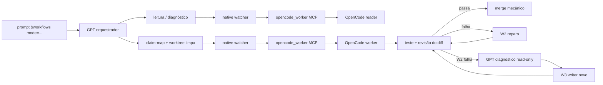

# Arquitetura do Codex Workflows Kit

Este documento resume os contratos que o instalador e
`scripts/validate.ps1` verificam. A fonte canônica da política de sub-agents é
`skills/workflows/references/backend-policy.md`; os demais arquivos apenas
explicam ou espelham esse contrato.

## Componentes

- `skills/workflows`: roteador dos modos `$workflows mode=<MODE>` e suas
  referências;
- `agents/opencode/*.md`: papéis OpenCode de leitura e escrita;
- `agents/*.toml`: perfis nativos, protegidos pelo guard de rota;
- `codex/AGENTS.md`: regras globais compactas;
- `plugins/mcp-foundation`: somente CodeGraph, Context7 e OpenAI Developer
  Docs;
- `scripts/`: instalação, validação, diagnóstico e remoção.

O perfil `safe` instala os assets, mas não configura MCP, OpenCode ou AHK. Essas
integrações continuam opt-in por flags do instalador.

## Rota de execução



O GPT orquestrador é dono do plano, dos contratos, do diagnóstico, dos testes,
da revisão e da aprovação. Ele não escreve nem improvisa patch. Em uma entrega
autorizada, todo patch nasce no OpenCode `worker`; o GPT só pode aplicar
mecanicamente o diff aceito no gate de merge.

O ciclo de escrita é fixo:

```text
PREFLIGHT -> W1 -> VERIFY
VERIFY pass -> ACCEPT/MERGE
VERIFY fail -> W2 repair (erro + diff anterior + hipótese alterada)
W2 fail -> diagnóstico read-only do GPT -> W3 writer novo
W3 fail ou sem hipótese nova -> BLOCKED/REPLAN
```

Falha de transporte pode receber uma nova tentativa pela mesma rota. Isso não
é fallback de conteúdo: nunca se troca OpenCode por perfil nativo, CLI direta
ou patch do GPT silenciosamente.

## Papéis e permissões

Readers (`scout`, `researcher`, `reviewer`) são somente leitura: `edit: deny` e
`bash: deny`. Writers (`worker`) podem editar apenas o claim-map em uma
worktree isolada: `edit: allow`, `bash: deny`, `task: deny` e
`external_directory: deny`.

Quando um reader recebe duas ou mais frentes independentes, o prompt contém
`NESTED_REQUIRED=<frentes>`. Ele deve delegar uma tarefa read-only por frente,
aguardar e integrar todas as respostas e retornar `NESTED_DELEGATION=used`. Se
`task` não estiver disponível, retorna `NESTED_DELEGATION=blocked`; não absorve
silenciosamente todas as frentes. Writers nunca delegam.

O fan-out de readers é obrigatório (`sidecar-gate`) para qualquer tarefa não
trivial, tarefa com duas ou mais frentes independentes, pedido explícito de
sub-agentes, risco de core/contrato ou obrigação explícita de revisão/teste —
mesmo sem ganho de tempo; frentes obrigatórias nunca são absorvidas
localmente. Apenas tarefas estritamente simples, seriais e de uma superfície
ficam locais.

Antes de um writer, o GPT confirma uma worktree absoluta diferente do checkout
principal, `git status --porcelain` vazio e registra
`WRITER_BASELINE=<git rev-parse HEAD>`. Também envia
`WRITER_WORKTREE=<cwd>`. Diff fora do claim-map ou mutação do checkout
principal bloqueia a integração.

Os perfis nativos analíticos (`scout`, `researcher`, `reviewer`, `worker`)
retornam `NATIVE_ROUTE_BLOCKED` enquanto o backend for OpenCode. O `watcher`
nativo é a única exceção textual: `gpt-5.6-luna` com esforço `high`, somente
para manter uma chamada MCP aberta e devolver seu resultado. Cada brief do
watcher exige o token explícito `OPEN_CODE_ROLE` em {scout, researcher,
reviewer, worker}; o watcher nunca adivinha e um token ausente/inválido
bloqueia antes da chamada MCP. O `relay` nativo
continua sendo apenas visual, transformando anexos em `[VISUAL_PACKET v1]`, sem
paths, bytes, base64 ou data URLs; o pai anexa somente esse texto sanitizado ao
brief do watcher e do papel OpenCode, e o modelo OpenCode (DeepSeek) nunca lê a
imagem diretamente.

## Jobs longos

Sidecars textuais usam a ponte do native `watcher` (`agent_type=watcher`):
`GPT -> watcher -> MCP opencode_worker -> papel OpenCode`. No handoff normal, o
`watcher` mantém uma chamada `run_agent` aberta e devolve um envelope curto; o
chat principal não fica fazendo polling e nunca chama `run_agent`/
`start_agent` diretamente para trabalho normal — a exposição do pai é apenas
`get_agent_status`/`get_agent_result`/`cancel_agent` para recuperação
declarada. Para jobs destacados ou recuperação, `start_agent` é exceção
explícita depois de a rota ser declarada: devolve um `job_id` e
`get_agent_status(job_id)` só é consultado no checkpoint de decisão. Heartbeat
vivo e `state=running` significam que deve aguardar; só `result_available=true`
ou estado terminal autoriza `get_agent_result`.

Heartbeat stale, processo ausente, erro MCP ou estado desconhecido exigem
diagnóstico e reparo/replanejamento; não autorizam espera cega, polling
contínuo, cancelamento ou relançamento sem nova decisão.

O ciclo de filhos usa `MAX_ACTIVE_CHILDREN_PER_CHAT=5`. Um filho live ou
aguardando é esperado; follow-up, `steer`, `interrupt` e retry não aceleram o
MCP. Ao retornar, o pai captura o envelope e fecha o filho. Fechamento precoce
exige crash confirmado por uma consulta diagnóstica; slots cheios só permitem
reclamar filhos terminais já capturados.

## Instalação e validação

`install.ps1` copia os assets com backup. `-Profile safe` instala a base;
`-ConfigureMcp` configura o MCP pinado; `-InstallAhk` instala o prompt pad.
O flag de runtime `CODEX_WORKFLOWS_OPENCODE_PROVIDER` seleciona a variante de
modelo (`go` padrão -> `opencode-go/deepseek-v4-flash`; `zen` ->
`zenmux/deepseek/deepseek-v4-flash`): é validado sem fallback silencioso, nunca
altera credenciais, é resolvido pelo wrapper em runtime sem reinstalação, e o
instalador renderiza o modelo selecionado explicitamente no perfil do watcher e
no bloco MCP do pai. Na ausência do flag, o wrapper preserva o `AGENT_MODEL`
renderizado/herdado e só usa o padrão `go` quando nenhum modelo foi herdado;
valores explícitos `go`/`zen` sobrescrevem o modelo. Após mudanças nas fontes,
execute
`scripts/install.ps1 -Profile safe` antes de validar os espelhos instalados.

`scripts/validate.ps1` verifica frontmatter, permissões, guard de rota,
exposição do MCP, contratos de nested delegation, ciclo de writers, paridade
dos destinos e higiene do diff. Health/config/hash não substituem smoke real:
quando solicitado, valide também a rota direta do MCP e o estado do job.
