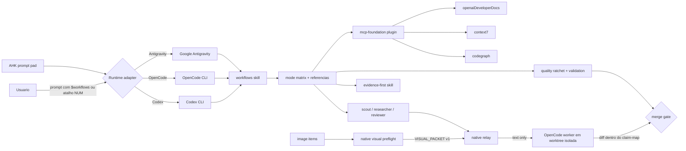
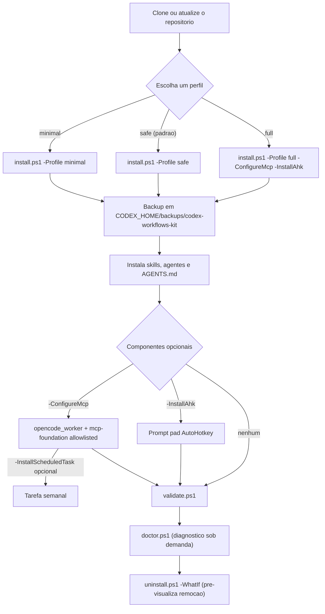

# Arquitetura do Codex Workflows Kit

Este documento descreve a arquitetura do kit: componentes, fluxo de uma
requisicao, permissionamento dos sub-agents e contratos que o validador
(`scripts/validate.ps1`) garante.

## Visao geral

O kit e uma colecao versionada de assets que sao instalados nos destinos reais
dos runtimes (Codex, Google Antigravity e OpenCode):

- **skills**: `workflows` (roteador canonico de modos) e `evidence-first`
  (verificacao condicional de claims materiais);
- **agents**: perfis nativos Codex (`relay`, `scout`, `researcher`,
  `reviewer`, `worker`) e definicoes OpenCode (`scout.md`, `researcher.md`,
  `reviewer.md`, `worker.md`);
- **codex/AGENTS.md**: instrucoes globais compactas;
- **plugins/mcp-foundation**: MCPs allowlisted (CodeGraph, Context7, OpenAI
  Developer Docs), marketplace local, hook de auditoria e mantenedor;
- **ahk/**: prompt pad AutoHotkey;
- **scripts/**: instalador, validador, doctor e uninstall.

A instancia canônica dos assets vive no repositorio; `install.ps1` copia para
os destinos do usuario (com backup antes de sobrescrever), e `validate.ps1`
confere estrutura, contratos e paridade entre repositorio e destinos.

## Componentes

### Perfis de instalação

O perfil minimal instala apenas as skills essenciais. O perfil safe (padrão)
instala skills, agentes e instruções do Codex, mas não configura MCP, OpenCode
ou AutoHotkey. O perfil full acrescenta as definições OpenCode, o wrapper, o
mantenedor e as skills nos dois destinos do Antigravity sob
AntigravityHome. MCP, tarefa agendada e AutoHotkey continuam opt-in por flags.

### Skill `workflows`

Roteador universal: um prefixo (`$workflows`, com os aliases
`$codex-workflows`, `$antigravity-workflows` e `$opencode-workflows` gerados
da mesma fonte) seleciona apenas o modo (`mode=<MODE>`). O contrato completo
de cada modo vive nas referencias:

- `dictionary.md` — expansao de aliases e terminologia;
- `mode-matrix.md` — roteamento de modos e perfis TN passivos;
- `runtime-adapters.md` — selecao de exatamente um adaptador por host;
- `backend-policy.md` — politica de sub-agents (`internal_subagent_backend`);
- `quality-ratchet.md` — filosofia TN aplicada ao trecho tocado;
- `observability.md` — gate de instrumentacao (padrao: nenhuma);
- `commit.md`, `research.md`, `subagents.md`, `validation.md`.

### Skill `evidence-first`

Sem atalho dedicado; e ativada para claims materiais (fatos atuais, externos
ou de alto impacto). Mantem um ledger compacto `{claim, source, evidence,
status}` e nunca preenche lacunas de evidencia a partir de memoria.

### Agents nativos (Codex)

Perfis TOML instalados em `~/.codex/agents`, cada um expandido pelo instalador
em variantes de esforco (`low`, `high`, `xhigh`, `max`):

| Perfil | Sandbox | Papel |
|---|---|---|
| `relay` | read-only | transporte nativo do sidecar; chama o MCP `opencode_worker` e repassa a resposta |
| `scout` | read-only | exploracao rapida de codigo |
| `researcher` | read-only | pesquisa profunda com rigor de fontes |
| `reviewer` | read-only | revisao independente |
| `worker` | write (override explicito) | manutencao; o writer padrao e o OpenCode `worker` |

### Agents OpenCode

Definicoes em `agents/opencode/`, sincronizadas pelo instalador para
`~/.codex/opencode-agents`:

- readers (`scout`, `researcher`, `reviewer`): `edit: deny`, `bash: deny`,
  `task: allow`, `external_directory: allow`;
- writer (`worker`): `edit: allow`, `bash: deny`, `task: deny`,
  `external_directory: deny`, `webfetch: deny`, `websearch: deny` — usado
  apenas com claim-map em worktree isolada.

### mcp-foundation

Plugin Codex com `mcpServers` apontando para `.mcp.json`, que expoe somente:

- `codegraph` (local, navegacao estrutural);
- `context7` (remoto, documentacao atual);
- `openaiDeveloperDocs` (remoto, docs OpenAI/Codex).

O hook `SessionStart` executa apenas uma auditoria local com TTL de 24 horas;
`maintain-mcps.ps1` cuida de reparo e, quando solicitado, da tarefa semanal,
sem encerrar processos MCP ativos.

### AHK prompt pad

`ahk/codex_prompt_pad.ahk` cola prompts `$workflows mode=...` via teclado NUM.
O instalador faz backup do arquivo existente antes de sobrescrever.

### Scripts

- `install.ps1` — instala skills, agentes, `AGENTS.md`, plugin e AHK;
  interface pública: perfis, `-ConfigureMcp`, `-InstallAhk`,
  `-InstallAntigravity`, `-InstallScheduledTask`, `-Force` e `-WhatIf`,
  além dos parâmetros de destino.
- `validate.ps1` — valida estrutura, frontmatter, contratos de permissao,
  bindings do AHK e paridade com destinos instalados.
- `doctor.ps1` — diagnóstico somente leitura do estado da última instalação.
- `uninstall.ps1` — remoção dos arquivos gerenciados, com `-WhatIf` para
  pre-visualizar; registros externos são preservados.

## Fluxo de uma requisicao

1. O usuario envia um prompt com `$workflows mode=<MODE>` (ou um atalho AHK).
2. O adaptador do runtime (Codex, OpenCode ou Antigravity) carrega a skill
   `workflows`; exatamente um adaptador e selecionado pela superficie do host.
3. O modo roteia para as referencias (mode-matrix, quality ratchet,
   validacao); tarefas simples permanecem locais, enquanto tarefas nao triviais
   ativam o fan-out read-only `quality-first-subA` entre frentes independentes.
4. Quando ha sidecar, o chat principal abre um perfil nativo `relay` novo com
   `{target_agent, cwd, task}`; quando o host suporta anexos multimodais, os anexos reais seguem
   como itens nativos fora do texto. O relay le esses itens, cria um
   `[VISUAL_PACKET v1]` textual sem paths/bytes e chama o MCP `opencode_worker`
   apenas com texto, modelo/variante configurados, repassando a resposta.
5. Readers preservam no-edit efetivo; writers usam o OpenCode `worker` com
   claim-map, worktree isolada e baseline registrado — habilitado por padrao
   sob `internal_subagent_policy=aggressive`, sem limite numerico artificial.
6. O chat principal revisa o diff, aplica o guard de caminhos e decide o merge
   no gate de decisao/final.

## Diagrama de arquitetura

## Diagrama de instalacao

## Contratos

### Modo = contrato completo

`mode=<MODE>` e o contrato padrao de execucao; texto opcional apos o modo e
contexto da tarefa ou override explicito. Os aliases de compatibilidade
resolvem para a mesma matriz de modos, regras de qualidade, gates de aceite e
contrato de validacao.

### Backend de sub-agents

- Padrao: `internal_subagent_backend=opencode` com
  `internal_subagent_transport=native_relay`.
- `internal_subagent_backend=native` e apenas override explicito de
  manutencao, solicitado pelo usuario.
- Indisponibilidade do relay/OpenCode preserva o gate como bloqueado; nunca
  ha fallback silencioso de provedor, modelo, esforco ou permissao.
- Quando o host suporta anexos multimodais, imagens seguem somente como itens
  nativos ate o relay. O MCP recebe um `[VISUAL_PACKET v1]` textual, sem path,
  data URL, base64 ou bytes de imagem; falha na leitura visual permanece
  bloqueada. Se itens anexados resultam em `RELAY_VISUAL=none` ou status ausente,
  o pai trata o sidecar como bloqueado/desconhecido.

### Politica de delegacao (`internal_subagent_policy`)

- `internal_subagent_policy=aggressive` e o padrao (delegate-first): o writer
  OpenCode fica habilitado por padrao para implementacao autorizada, sem limite
  numerico artificial — a quantidade de writers segue as frentes independentes
  do claim-map. O GPT principal permanece dono da arquitetura, integracao,
  testes e aprovacao final, e escreve diretamente apenas em fallback final, sem
  progresso ou integracao critica compartilhada.
- `internal_subagent_policy=conservative` mantem o comportamento proporcional
  atual: tarefas simples locais; writer somente para slices isoladas de
  claim-map.
- A politica nao muda os gates: claim-map, no-touch, worktree isolada,
  `WRITER_BASELINE`, revisao do diff e merge gate continuam obrigatorios; nenhum
  MCP ou tool novo e adicionado.
- Handoff de reparo: writer que falha ou nao progride e religado com erro
  observado + diff anterior + hipotese alterada; briefs compactos (claim-map,
  no-touch, contrato de validacao), sem historico completo. O contexto do
  handoff e local a sessao; quando solicitado, o resumo inclui
  readers/writers, frentes paralelas, reparos, falhas/bloqueios, deduplicacao,
  diff fora de escopo, fallback GPT, tempo e resultado, sem persistencia,
  telemetria ou metrica de tokens do GPT principal.
- `no-edit` impede o spawn de writer sob qualquer politica; nao elevar
  permissoes silenciosamente — preserve o gate como bloqueado.

### Writer isolado

Antes de um writer relay, o agente principal resolve a worktree absoluta,
confirma que difere do checkout principal, registra `WRITER_BASELINE`
(`git rev-parse HEAD`) e exige `git status --porcelain` vazio; passa
`WRITER_WORKTREE=<cwd>` e `WRITER_BASELINE=<full-commit>` na tarefa. Depois da
resposta, compara o diff da worktree contra o baseline e o claim-map; qualquer
caminho fora do escopo ou mutacao do checkout principal bloqueia a integracao.

### Validacao

`validate.ps1` confere frontmatter das skills, contratos de permissao dos
agents OpenCode (inclusive a ausencia de definicoes inesperadas), allowlist do
MCP, hook de auditoria, bindings do AHK, referencias da skill e paridade dos
destinos instalados.

## Referencias

- `README.md` — visao publica, instalacao e uso.
- `docs/security.md` — modelo de ameacas e mitigacoes.
- `docs/agent-bootstrap-prompt.md` — prompt copiavel para vincular um agente.
- `scripts/validate.ps1` — o validador e a especificacao executavel dos
  contratos aqui descritos.
